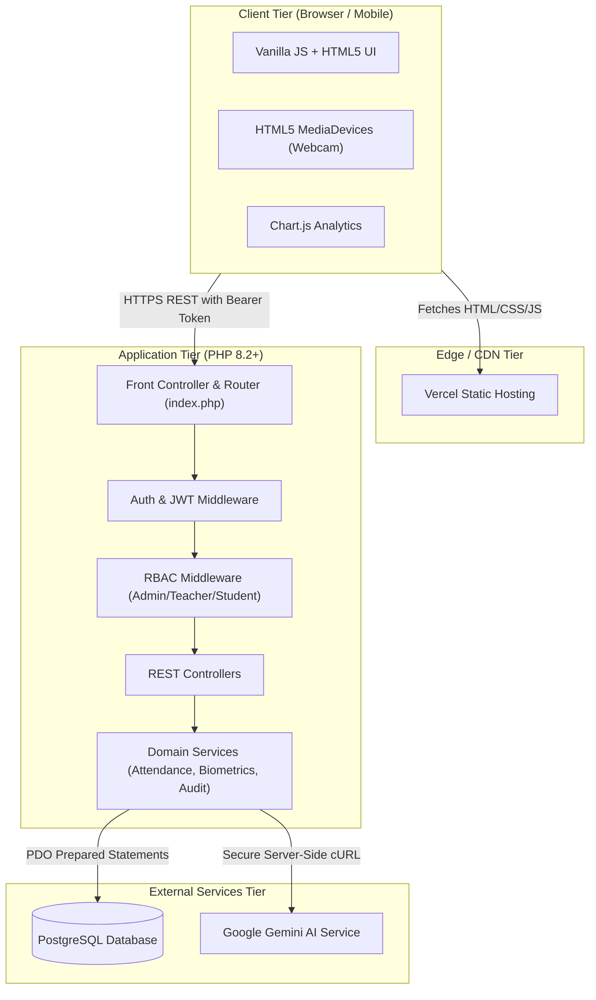

# SAMS System Architecture Specification

## 1. System Overview
The **Student Attendance Management System (SAMS)** is architected as a decoupled, multi-tier web application designed for high availability, security, and scalability in academic institutions.

---

## 2. Core Architectural Principles

### Two-Tier Separation
The frontend and backend are completely decoupled. The frontend communicates with the backend exclusively via standard JSON REST endpoints over HTTPS. This allows the frontend to be hosted on Vercel or any static edge CDN, while the PHP backend runs in a containerized environment (Railway, Docker, VPS).

### Stateless Token Authentication with Session Fallback
Authentication supports two paradigms:
1. **Bearer JWT Token**: Generated on `/api/auth/login` and included in HTTP headers (`Authorization: Bearer <token>`). Ideal for cross-domain REST APIs.
2. **Secure PHP Session**: Uses `session_regenerate_id(true)` upon authentication to protect against session fixation.

### Database Layer Abstraction
- Primary production engine: **PostgreSQL 13+** with parameterized queries, foreign keys with cascading actions, and database-level unique constraints.
- Development fallback: Automatic, zero-configuration **SQLite** fallback for instant local offline development without requiring external database services.

### Error Handling & Boundaries
- All uncaught exceptions are trapped by a global handler in `index.php`.
- In production (`APP_DEBUG=false`), stack traces and internal database errors are hidden from API clients, returning sanitized error codes while logging details to server logs.
